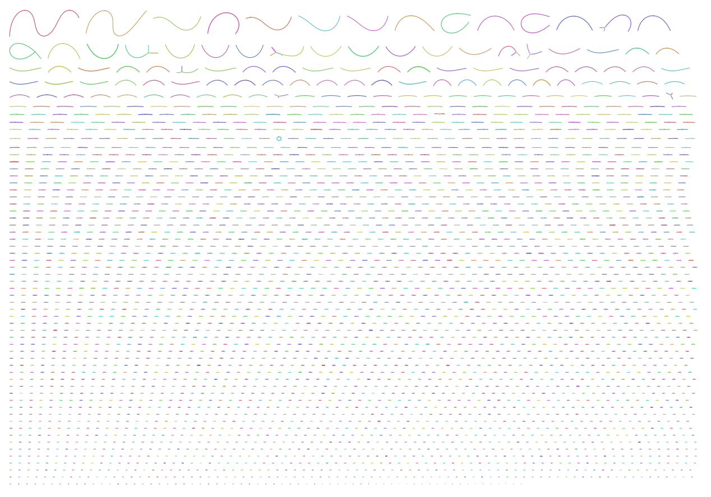

# Metagenomics - Full analysis

During the [metagenomics practical](../Practicals/06_Metagenomics.md) we have analysed several metagenomic datasets.
However, we recovered only few high-quality bins from the datasets.
Here we will try using all data (instead of only a subset) to see if this can improve our results.
We will only document the used code, and provide the most relevant results, so you can compare to the results from the practical yourself.

## QC and trimming

The different read sets have been trimmed of adapters and low-quality bases:

- The Illumina short reads have been trimmed using cutadapt (`-q 30,30`; `-m 30`; `-a AGATCGGAAGAGCACACGTCTGAACTCCAGTCA`; `-A AGATCGGAAGAGCGTCGTGTAGGGAAAGAGTGT`)
- The HiFi reads have been adapter trimmed using HiFiAdapterFilt (see [here](Assembly_FullAnalysis.md) for the commands and reference)

## Data

We worked with:

- Plant metagenome: 2x4.5M instead of 2x2.5M short reads
- Stool metagenome: 2x7.8M instead of 2x2.5M short reads
- Sea metagenome: 190k instead of 75k long HiFi reads

##  Metagenome assembly

We assembled the short reads using metaSPAdes, and the long reads using Flye in metagenome mode.
We additionly tried assembling the long reads using [hifiasm-meta](https://github.com/lh3/hifiasm-meta):

```
metaspades.py -t 64 -1 Plant_F.filt.fastq -2 Plant_R.filt.fastq -o Plant_metaspades
metaspades.py -t 64 -1 Stool_F.filt.fastq -2 Stool_R.filt.fastq -o Stool_metaspades
flye -t 64 --meta --pacbio-hifi Sea_HiFi.filt.fastq -o Sea_metaFlye
hifiasm_meta -t 64 -o Sea_hifiasm Sea_HiFi.filt.fastq
```

Below you can find the Bandage visualizations of the assembly graphs:

Plant - metaSPAdes


> We still see nicely one genome popping up

Stool - metaSPAdes


> The graph is very big, and only the largest components are shown.
> The two large clusters on the top are together +- 35Mb, so are likely a combination of multiple genomes.
> The connections between them could be from overlapping regions (conserved regions/shared repeats).
> Based on this graph we might be able to recover some more high quality genomes.

Sea - metaFlye


> Again the graph is untangled, but the largest component is only +- 150kb long.
> Based on this it might be unlikely again we can recover a full genome.

Sea - hifiasm-meta


> The graph is similar to the metaFlye one, but the largerst contig is longer (+- 1.5Mbp).
> It looks like we might get better results using this assembly.

## Metagenome binning

The we do the same binning process as in the tutorial:

```
mkdir binning
ln -s ${PWD}/Plant_meta.fasta binning/Plant_meta.fasta
ln -s ${PWD}/Stool_meta.fasta binning/Stool_meta.fasta
ln -s ${PWD}/Sea_metaFlye/assembly.fasta binning/Sea_meta.fasta
ln -s ${PWD}/Sea_hifiasm_meta.fasta binning/Sea_hifiasm_meta.fasta
cd binning

bwa-mem2 index -p PMindex Plant_meta.fasta
bwa-mem2 index -p SMindex Stool_meta.fasta
mkdir mapping
bwa-mem2 mem -t 64 PMindex ../Plant_F.filt.fastq ../Plant_R.filt.fastq | samtools view -bS | samtools sort -@32 > mapping/Plant.bam
bwa-mem2 mem -t 64 SMindex ../Stool_F.filt.fastq ../Stool_R.filt.fastq | samtools view -bS | samtools sort -@32 > mapping/Stool.bam
minimap2 -t 64 -ax map-hifi Sea_meta.fasta ../Sea_HiFi.filt.fastq | samtools view -bS | samtools sort -@32 > mapping/Sea.bam
minimap2 -t 64 -ax map-hifi Sea_hifiasm_meta.fasta ../Sea_HiFi.filt.fastq | samtools view -bS | samtools sort -@32 > mapping/Sea_hifiasm.bam
samtools index mapping/Plant.bam
samtools index mapping/Stool.bam
samtools index mapping/Sea.bam
samtools index mapping/Sea_hifiasm.bam

cut_up_fasta.py Plant_meta.fasta -c 10000 -o 0 --merge_last -b Plant_10k.bed > Plant_10k.fa
cut_up_fasta.py Stool_meta.fasta -c 10000 -o 0 --merge_last -b Stool_10k.bed > Stool_10k.fa
cut_up_fasta.py Sea_meta.fasta -c 10000 -o 0 --merge_last -b Sea_10k.bed > Sea_10k.fa
cut_up_fasta.py Sea_hifiasm_meta.fasta -c 10000 -o 0 --merge_last -b Sea_hifiasm_10k.bed > Sea_hifiasm_10k.fa

concoct_coverage_table.py Plant_10k.bed mapping/Plant.bam > Plant_cov.tsv
concoct_coverage_table.py Stool_10k.bed mapping/Stool.bam > Stool_cov.tsv
concoct_coverage_table.py Sea_10k.bed mapping/Sea.bam > Sea_cov.tsv
concoct_coverage_table.py Sea_hifiasm_10k.bed mapping/Sea_hifiasm.bam > Sea_hifiasm_cov.tsv

concoct --threads 64 --composition_file Plant_10k.fa --coverage_file Plant_cov.tsv -b Plant_binning
concoct --threads 64 --composition_file Stool_10k.fa --coverage_file Stool_cov.tsv -b Stool_binning
concoct --threads 64 --composition_file Sea_10k.fa --coverage_file Sea_cov.tsv -b Sea_binning
concoct --threads 64 --composition_file Sea_hifiasm_10k.fa --coverage_file Sea_hifiasm_cov.tsv -b Sea_hifiasm_binning

merge_cutup_clustering.py Plant_binning_clustering_gt1000.csv > Plant_binning_clustering_merged.csv
merge_cutup_clustering.py Stool_binning_clustering_gt1000.csv > Stool_binning_clustering_merged.csv
merge_cutup_clustering.py Sea_binning_clustering_gt1000.csv > Sea_binning_clustering_merged.csv
merge_cutup_clustering.py Sea_hifiasm_binning_clustering_gt1000.csv > Sea_hifiasm_binning_clustering_merged.csv

mkdir Plant_bins Stool_bins Sea_bins Sea_hifiasm_bins
extract_fasta_bins.py Plant_meta.fasta Plant_binning_clustering_merged.csv --output_path Plant_bins
extract_fasta_bins.py Stool_meta.fasta Stool_binning_clustering_merged.csv --output_path Stool_bins
extract_fasta_bins.py Sea_meta.fasta Sea_binning_clustering_merged.csv --output_path Sea_bins
extract_fasta_bins.py Sea_hifiasm_meta.fasta Sea_hifiasm_binning_clustering_merged.csv --output_path Sea_hifiasm_bins
```

### Binning QC

We run Quast on all bins to get a first idea of what we have:

```
cd Plant_bins && quast.py *fa
cd ../Stool_bins && quast.py *fa
cd ../Sea_bins && quast.py *fa
cd ../Sea_hifiasm_bins && quast.py *fa
```

You can take look at the quast reports using the links below:

- [Plant](PlantBins_Quast.html)
- [Stool](StoolBins_Quast.html)
- [Sea-metaFly](SeaBins_Quast.html)
- [Sea-hifiasm](SeaBins_hifiasm_Quast.html)

> We can see that there might be a couple more complete genomes in the Stool sample that we recovered.
> In the sea sample we also have larger bins, and possibly some (more) complete genomes. The HiFiAsm-meta assembly gives better results than the metaFlye one.

Then, we'll run CheckM again to have a better overview of our genomes, and how good they are:

```
checkm lineage_wf Plant_bins/ Plant_checkm -x .fa -t 64
---------------------------------------------------------------------------------------------------------------------------------------------------------------------
  Bin Id           Marker lineage           # genomes   # markers   # marker sets   0     1    2   3   4   5+   Completeness   Contamination   Strain heterogeneity
---------------------------------------------------------------------------------------------------------------------------------------------------------------------
  6        f__Streptomycetaceae (UID2048)       60         460           233        1    453   6   0   0   0       99.89            0.93               0.00
  9                 root (UID1)                5656         56            24        56    0    0   0   0   0        0.00            0.00               0.00
  8                 root (UID1)                5656         56            24        56    0    0   0   0   0        0.00            0.00               0.00
  7                 root (UID1)                5656         56            24        56    0    0   0   0   0        0.00            0.00               0.00
  5                 root (UID1)                5656         56            24        56    0    0   0   0   0        0.00            0.00               0.00
  4                 root (UID1)                5656         56            24        56    0    0   0   0   0        0.00            0.00               0.00
  3                 root (UID1)                5656         56            24        56    0    0   0   0   0        0.00            0.00               0.00
  2                 root (UID1)                5656         56            24        56    0    0   0   0   0        0.00            0.00               0.00
  1                 root (UID1)                5656         56            24        56    0    0   0   0   0        0.00            0.00               0.00
  0                 root (UID1)                5656         56            24        56    0    0   0   0   0        0.00            0.00               0.00
---------------------------------------------------------------------------------------------------------------------------------------------------------------------

checkm lineage_wf Stool_bins/ Stool_checkm -x .fa -t 64
--------------------------------------------------------------------------------------------------------------------------------------------------------------------------
  Bin Id            Marker lineage           # genomes   # markers   # marker sets    0     1     2    3    4   5+   Completeness   Contamination   Strain heterogeneity
--------------------------------------------------------------------------------------------------------------------------------------------------------------------------
  14         o__Selenomonadales (UID1024)        64         334           167         0    333    1    0    0   0       100.00           0.30               0.00
  8        f__Bifidobacteriaceae (UID1462)       65         476           217         1    472    3    0    0   0       99.54            0.69              66.67
  2           o__Clostridiales (UID1226)        155         278           158         1    265    12   0    0   0       99.37            2.04               8.33
  6        f__Enterobacteriaceae (UID5162)       88         1207          328         14   1162   31   0    0   0       98.85            2.16              19.35
  26          o__Bacteroidales (UID2657)        160         492           269         10   460    21   1    0   0       98.75            6.74              25.00
  5           o__Clostridiales (UID1212)        172         261           147         4    254    3    0    0   0       97.28            1.50              100.00
  3           o__Clostridiales (UID1212)        172         261           147         8    249    4    0    0   0       96.24            0.45              50.00
  16             k__Bacteria (UID203)           5449        103            58         20    8     34   40   1   0       93.34           139.14             60.62
  42            k__Bacteria (UID2372)           131         177           106         10   147    19   1    0   0       91.89           13.09              36.36
  19         f__Lachnospiraceae (UID1256)        33         333           171         23   241    68   1    0   0       91.26           23.63              12.68
  50          o__Clostridiales (UID1120)        304         249           142         56   192    1    0    0   0       76.63            0.23               0.00
  0              k__Bacteria (UID203)           5449        103            57         24    61    18   0    0   0       67.91            6.06              11.11
  30          o__Clostridiales (UID1226)        155         274           157        102   117    49   6    0   0       66.02           22.69               7.46
  7              k__Bacteria (UID203)           5449        104            58         58    46    0    0    0   0       64.74            0.00               0.00
  25          g__Lactobacillus (UID436)          31         586           184        194   385    7    0    0   0       62.70            1.48              14.29
  47         p__Proteobacteria (UID3887)        1487        256           161        163    88    5    0    0   0       33.88            2.05               0.00
  34             k__Bacteria (UID203)           5449        104            58         71    14    6    13   0   0       30.96            9.72              75.56
  53             k__Bacteria (UID203)           5449        103            57         70    27    4    2    0   0       26.17            7.60              40.00
  41          o__Clostridiales (UID1212)        172         257           149        189    66    2    0    0   0       24.25            0.89               0.00
  48                 root (UID1)                5656         56            24         53    3     0    0    0   0        6.25            0.00               0.00
  37             k__Bacteria (UID203)           5449        103            57         95    8     0    0    0   0        5.61            0.00               0.00
  11             k__Bacteria (UID203)           5449        103            57        101    2     0    0    0   0        1.75            0.00               0.00
  54             k__Bacteria (UID203)           5449        104            58        101    3     0    0    0   0        0.47            0.00               0.00
  9                  root (UID1)                5656         56            24         56    0     0    0    0   0        0.00            0.00               0.00
  52                 root (UID1)                5656         56            24         56    0     0    0    0   0        0.00            0.00               0.00
  51                 root (UID1)                5656         56            24         56    0     0    0    0   0        0.00            0.00               0.00
  49                 root (UID1)                5656         56            24         56    0     0    0    0   0        0.00            0.00               0.00
  46                 root (UID1)                5656         56            24         56    0     0    0    0   0        0.00            0.00               0.00
  45                 root (UID1)                5656         56            24         56    0     0    0    0   0        0.00            0.00               0.00
  44                 root (UID1)                5656         56            24         56    0     0    0    0   0        0.00            0.00               0.00
  43                 root (UID1)                5656         56            24         56    0     0    0    0   0        0.00            0.00               0.00
  40                 root (UID1)                5656         56            24         56    0     0    0    0   0        0.00            0.00               0.00
  4                  root (UID1)                5656         56            24         56    0     0    0    0   0        0.00            0.00               0.00
  39                 root (UID1)                5656         56            24         56    0     0    0    0   0        0.00            0.00               0.00
  38                 root (UID1)                5656         56            24         56    0     0    0    0   0        0.00            0.00               0.00
  36                 root (UID1)                5656         56            24         56    0     0    0    0   0        0.00            0.00               0.00
  35                 root (UID1)                5656         56            24         56    0     0    0    0   0        0.00            0.00               0.00
  33                 root (UID1)                5656         56            24         56    0     0    0    0   0        0.00            0.00               0.00
  32                 root (UID1)                5656         56            24         56    0     0    0    0   0        0.00            0.00               0.00
  31                 root (UID1)                5656         56            24         56    0     0    0    0   0        0.00            0.00               0.00
  29                 root (UID1)                5656         56            24         56    0     0    0    0   0        0.00            0.00               0.00
  28                 root (UID1)                5656         56            24         56    0     0    0    0   0        0.00            0.00               0.00
  27                 root (UID1)                5656         56            24         56    0     0    0    0   0        0.00            0.00               0.00
  24                 root (UID1)                5656         56            24         56    0     0    0    0   0        0.00            0.00               0.00
  23                 root (UID1)                5656         56            24         56    0     0    0    0   0        0.00            0.00               0.00
  22                 root (UID1)                5656         56            24         56    0     0    0    0   0        0.00            0.00               0.00
  21                 root (UID1)                5656         56            24         56    0     0    0    0   0        0.00            0.00               0.00
  20                 root (UID1)                5656         56            24         56    0     0    0    0   0        0.00            0.00               0.00
  18                 root (UID1)                5656         56            24         56    0     0    0    0   0        0.00            0.00               0.00
  17                 root (UID1)                5656         56            24         56    0     0    0    0   0        0.00            0.00               0.00
  15                 root (UID1)                5656         56            24         56    0     0    0    0   0        0.00            0.00               0.00
  13                 root (UID1)                5656         56            24         56    0     0    0    0   0        0.00            0.00               0.00
  12                 root (UID1)                5656         56            24         56    0     0    0    0   0        0.00            0.00               0.00
  10                 root (UID1)                5656         56            24         56    0     0    0    0   0        0.00            0.00               0.00
  1                  root (UID1)                5656         56            24         56    0     0    0    0   0        0.00            0.00               0.00
--------------------------------------------------------------------------------------------------------------------------------------------------------------------------

checkm lineage_wf Sea_bins/ Sea_checkm -x .fa -t 64
---------------------------------------------------------------------------------------------------------------------------------------------------------------------------
  Bin Id            Marker lineage            # genomes   # markers   # marker sets    0     1    2    3    4    5+   Completeness   Contamination   Strain heterogeneity
---------------------------------------------------------------------------------------------------------------------------------------------------------------------------
  40             k__Bacteria (UID203)            5449        104            58         1     41   59   3    0    0       98.28           62.23              22.06
  23             k__Bacteria (UID203)            5449        104            58         2     11   14   27   41   9       96.55           180.92             54.59
  14             k__Bacteria (UID203)            5449        104            58         2     22   47   28   5    0       96.55           88.98              28.57
  35             k__Bacteria (UID203)            5449        104            58         3     59   41   0    1    0       95.69           31.35              100.00
  13             k__Bacteria (UID203)            5449        104            58         4     13   13   27   31   16      94.83           181.76             77.55
  8        c__Gammaproteobacteria (UID4443)      356         451           270         56   381   14   0    0    0       84.63            2.75               7.14
  37       c__Gammaproteobacteria (UID4443)      356         451           270        152   252   45   2    0    0       65.41           11.77              43.14
  12       c__Gammaproteobacteria (UID4443)      356         451           270        171   181   79   17   3    0       56.68           23.98              13.51
  24       c__Alphaproteobacteria (UID3305)      564         348           229        171   109   58   6    4    0       53.52           25.58              44.00
  17         p__Proteobacteria (UID3882)         1493        261           164        131    97   28   5    0    0       51.77           15.75              79.07
  38       c__Gammaproteobacteria (UID4444)      263         502           230        272   194   35   0    1    0       44.91            6.34              58.54
  25       c__Gammaproteobacteria (UID4443)      356         451           270        243   158   44   5    1    0       41.71           12.47              30.77
  19            k__Bacteria (UID2982)             88         230           148        143    83   4    0    0    0       35.87            2.03              100.00
  10         p__Proteobacteria (UID3880)         1495        261           164        163    96   2    0    0    0       31.27            1.22              100.00
  0        c__Gammaproteobacteria (UID4443)      356         451           270        317   128   6    0    0    0       30.44            1.42              50.00
  32             k__Bacteria (UID203)            5449        104            58         71    20   13   0    0    0       29.31            7.68              30.77
  6              k__Bacteria (UID203)            5449        103            57         78    15   10   0    0    0       22.49           11.40              100.00
  36             k__Bacteria (UID203)            5449        104            58         69    20   10   5    0    0       14.26            5.96              12.00
  20             k__Bacteria (UID203)            5449        104            58         93    11   0    0    0    0       13.79            0.00               0.00
  33             k__Bacteria (UID203)            5449        104            58         98    6    0    0    0    0        9.48            0.00               0.00
  1                  root (UID1)                 5656         56            24         55    1    0    0    0    0        4.17            0.00               0.00
  2          p__Proteobacteria (UID3880)         1495        242           151        213    22   7    0    0    0        2.11            0.36              42.86
  39             k__Bacteria (UID203)            5449        104            58         97    7    0    0    0    0        1.10            0.00               0.00
  9                  root (UID1)                 5656         56            24         56    0    0    0    0    0        0.00            0.00               0.00
  7                  root (UID1)                 5656         56            24         56    0    0    0    0    0        0.00            0.00               0.00
  5                  root (UID1)                 5656         56            24         56    0    0    0    0    0        0.00            0.00               0.00
  4                  root (UID1)                 5656         56            24         56    0    0    0    0    0        0.00            0.00               0.00
  34                 root (UID1)                 5656         56            24         56    0    0    0    0    0        0.00            0.00               0.00
  31                 root (UID1)                 5656         56            24         56    0    0    0    0    0        0.00            0.00               0.00
  30                 root (UID1)                 5656         56            24         56    0    0    0    0    0        0.00            0.00               0.00
  3                  root (UID1)                 5656         56            24         56    0    0    0    0    0        0.00            0.00               0.00
  29                 root (UID1)                 5656         56            24         56    0    0    0    0    0        0.00            0.00               0.00
  28                 root (UID1)                 5656         56            24         56    0    0    0    0    0        0.00            0.00               0.00
  27                 root (UID1)                 5656         56            24         56    0    0    0    0    0        0.00            0.00               0.00
  26                 root (UID1)                 5656         56            24         56    0    0    0    0    0        0.00            0.00               0.00
  22                 root (UID1)                 5656         56            24         56    0    0    0    0    0        0.00            0.00               0.00
  21                 root (UID1)                 5656         56            24         56    0    0    0    0    0        0.00            0.00               0.00
  18                 root (UID1)                 5656         56            24         56    0    0    0    0    0        0.00            0.00               0.00
  16                 root (UID1)                 5656         56            24         56    0    0    0    0    0        0.00            0.00               0.00
  15                 root (UID1)                 5656         56            24         56    0    0    0    0    0        0.00            0.00               0.00
  11                 root (UID1)                 5656         56            24         56    0    0    0    0    0        0.00            0.00               0.00
---------------------------------------------------------------------------------------------------------------------------------------------------------------------------

checkm lineage_wf Sea_hifiasm_bins/ Sea_hifiasm_checkm -x .fa -t 64
---------------------------------------------------------------------------------------------------------------------------------------------------------------------------
  Bin Id            Marker lineage            # genomes   # markers   # marker sets    0     1    2    3    4    5+   Completeness   Contamination   Strain heterogeneity
---------------------------------------------------------------------------------------------------------------------------------------------------------------------------
  3              k__Bacteria (UID203)            5449        104            58         1     18   39   39   6    1       98.28           125.05             25.25
  1              k__Bacteria (UID203)            5449        104            58         1     44   37   19   3    0       98.28           100.49              9.82
  5              k__Bacteria (UID203)            5449        104            58         2     5    22   33   18   24      96.55           281.11             49.38
  18       c__Alphaproteobacteria (UID3305)      564         349           230         11   326   12   0    0    0       95.65            4.13              50.00
  4              k__Bacteria (UID203)            5449        104            58         6     35   35   21   7    0       92.24           74.61              59.29
  2              k__Bacteria (UID203)            5449         99            53         5     7    20   7    6    54      90.57           316.90             16.09
  19             k__Bacteria (UID203)            5449        104            58         8     24   43   26   3    0       90.52           101.25             38.85
  14             k__Bacteria (UID203)            5449        104            58         8     13   31   48   4    0       90.52           107.13             65.33
  0              k__Bacteria (UID203)            5449        104            58         9     14   30   18   24   9       87.93           183.78             28.96
  17             k__Bacteria (UID203)            5449        104            58         12    66   17   9    0    0       84.48           30.06              11.36
  11             k__Bacteria (UID203)            5449        104            58         14    28   51   11   0    0       83.46           68.55              60.71
  31             k__Bacteria (UID203)            5449        104            58         26    21   40   13   3    1       81.03           75.86              15.89
  26             k__Bacteria (UID203)            5449        102            58         13    27   34   25   3    0       81.03           86.86              41.73
  29             k__Bacteria (UID203)            5449        104            58         23    18   28   30   5    0       68.97           66.50              37.16
  20       c__Alphaproteobacteria (UID3305)      564         349           230        130   195   23   1    0    0       61.62            9.02              73.08
  8             k__Bacteria (UID1453)            901         171           117         73    96   2    0    0    0       51.79            0.85               0.00
  7              k__Bacteria (UID203)            5449        104            58         66    34   4    0    0    0       48.43            6.90               0.00
  22             k__Bacteria (UID203)            5449        104            58         50    27   25   2    0    0       47.96           18.73              80.65
  21              k__Archaea (UID2)              207         145           103         77    59   9    0    0    0       39.32            3.29              88.89
  30             k__Bacteria (UID203)            5449        104            58         64    26   14   0    0    0       37.93            7.99               7.14
  9              k__Bacteria (UID203)            5449        104            58         52    29   23   0    0    0       33.86            5.17              95.65
  24             k__Bacteria (UID203)            5449        103            57         45    24   34   0    0    0       31.58            9.41               0.00
  25             k__Bacteria (UID203)            5449        104            58         87    12   5    0    0    0       25.86            5.17               0.00
  12        f__Rhodobacteraceae (UID3340)         84         568           330        415   140   13   0    0    0       25.49            2.73               0.00
  10             k__Bacteria (UID203)            5449        104            58         61    14   15   14   0    0       23.35           16.07              38.60
  32             k__Bacteria (UID203)            5449        104            58         92    11   1    0    0    0       17.24            1.72               0.00
  13             k__Bacteria (UID203)            5449         99            53         56    21   22   0    0    0       16.81            7.03               0.00
  23             k__Bacteria (UID203)            5449        104            58         96    8    0    0    0    0       11.21            0.00               0.00
  15                 root (UID1)                 5656         56            24         54    2    0    0    0    0        8.33            0.00               0.00
  27            k__Bacteria (UID2982)             88         229           147        195    34   0    0    0    0        6.12            0.00               0.00
  6              k__Bacteria (UID203)            5449        104            58        101    3    0    0    0    0        5.17            0.00               0.00
  28                 root (UID1)                 5656         56            24         56    0    0    0    0    0        0.00            0.00               0.00
  16                 root (UID1)                 5656         56            24         56    0    0    0    0    0        0.00            0.00               0.00
---------------------------------------------------------------------------------------------------------------------------------------------------------------------------
```
> We seen improvements in all samples when using the full read dataset.
> Based on the results we have multiple high-quality (>7) genomes from the Stool sample, with low contamination.
> The Sea sample is more difficult. We manage to get quite some (near-)complete genomes, but with high contamination.
> CheckM has problems identifying most of them, either because they are exotic species, or because they are a mixture of species.
> As mentioned in the main tutorial, binning using a long-read specific binner might be more appropriate, as coverage-based binning is difficult for long reads.