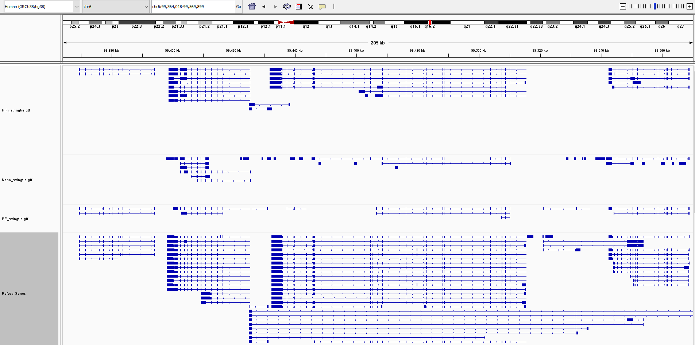
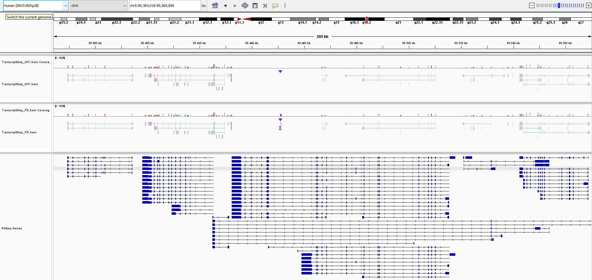

# Transcriptome - Full analysis

During the [transcriptome practical](../Practicals/05_Transcriptome.md) we have generated several transcriptomes from reads mapped to the human Chr15.
Here we want to show how the transcriptome analysis would have looked like if we had used all reads, mapping to the whole human genome.
We will only document the used code, and provide the most relevant results, so you can compare to the results from the practical yourself.

## QC and trimming

The reads have been trimmed as follows:

- The Illumina RNA reads have been trimmed using cutadapt (`-q 30,30`; `-m 30`; `-a AGATCGGAAGAGCACACGTCTGAACTCCAGTCA`; `-A AGATCGGAAGAGCGTCGTGTAGGGAAAGAGTGT`; `--poly-a`)
- The Nanopore RNA reads have been adapter trimmed using Porechop, quality trimmed using NanoFilt (see [here](Assembly_FullAnalysis.md) for the commands and references)
- The HiFi RNA reads have been adapter trimmed using HiFiAdapterFilt (see [here](Assembly_FullAnalysis.md) for the commands and reference)
- Cutadapt was used to further remove poly-A tails after trimmming the long reads

## Reference-based transcriptome assembly

The full set of short reads (2x6.1M reads) were mapped to the full human genome using HiSat2, and we used Stringtie to assemble the transcripts.
We used the full human genome, downloaded from [GENCODE](https://www.gencodegenes.org/human/), the GENCODE annotation, 
and the [MANE](https://www.ncbi.nlm.nih.gov/refseq/MANE/) transcript set (containing one transcript per locus).

```
wget https://ftp.ncbi.nlm.nih.gov/refseq/MANE/MANE_human/current/MANE.GRCh38.v1.3.refseq_genomic.gff.gz
gunzip MANE.GRCh38.v1.3.refseq_genomic.gff.gz && mv MANE.GRCh38.v1.3.refseq_genomic.gff MANE.gff
wget https://ftp.ebi.ac.uk/pub/databases/gencode/Gencode_human/release_46/gencode.v46.basic.annotation.gff3.gz
gunzip gencode.v46.basic.annotation.gff3.gz && mv gencode.v46.basic.annotation.gff3 human.gff3
wget https://ftp.ebi.ac.uk/pub/databases/gencode/Gencode_human/release_46/gencode.v46.basic.annotation.gtf.gz
gunzip gencode.v46.basic.annotation.gtf.gz && mv gencode.v46.basic.annotation.gtf human.gtf
wget https://ftp.ebi.ac.uk/pub/databases/gencode/Gencode_human/release_46/GRCh38.p14.genome.fa.gz
gunzip GRCh18.p14.genome.fa
head -n51471479 GRCh38.14.genome.fa > human.fasta
```
> We use the head command because the human genome contains a lot of "patches" and alternative sequences that we are not interested in.
> With the head command, we take only the main chromosomes, sex chromosomes, and mitochondrial sequence.

```
hisat2_extract_splice_sites.py human.gtf > human.ss
hisat2_extract_exons.py human.gtf > human.exons
hisat2-build -p 64 --exon human.exons --ss human.ss human.fasta human.index

hisat2 -p 64 --dta -x human.index --max-intronlen 5000 \
-1 RNA_PE_F.filt.fastq -2 RNA_PE_R.filt.fastq \
| samtools view -Sb \
| samtools sort -@32 > RNA_PE.bam

stringtie -p 64 -o PE_stringtie.gtf RNA_PE.bam

gffcompare -r human.gff3 -o PE_Full.gffcompare.txt PE_stringtie.gtf && cat PE_Full.gffcompare.txt
#= Summary for dataset: PE_stringtie.gtf
#     Query mRNAs :   24482 in   17874 loci  (23558 multi-exon transcripts)
#            (4533 multi-transcript loci, ~1.4 transcripts per locus)
# Reference mRNAs :  118166 in   58452 loci  (93603 multi-exon)
# Super-loci w/ reference transcripts:    12136
#-----------------| Sensitivity | Precision  |
        Base level:    23.6     |    92.9    |
        Exon level:    30.8     |    82.4    |
      Intron level:    37.7     |    96.7    |
Intron chain level:    10.8     |    42.9    |
  Transcript level:     8.7     |    42.1    |
       Locus level:    13.7     |    46.0    |

     Matching intron chains:   10106
       Matching transcripts:   10296
              Matching loci:    8011

          Missed exons:  238905/413370  ( 57.8%)
           Novel exons:    2671/135983  (  2.0%)
        Missed introns:  159484/300163  ( 53.1%)
         Novel introns:     942/117114  (  0.8%)
           Missed loci:   46219/58452   ( 79.1%)
            Novel loci:     769/17874   (  4.3%)

 Total union super-loci across all input datasets: 12905
24482 out of 24482 consensus transcripts written in PE_Full.gffcompare.annotated.gtf (0 discarded as redundant)
```
> We can see that the precision is quite good (similar to the subset), but we don't manage to get a lot of the transcripts.
> This is mainly because the GENCODE annotation contains a lot of alternative splice variants, which we can't all detect using our data.

Compared to the MANE transcript set (containing one transcript per locus):

```
gffcompare -r MANE.gff -o PE_MANE.gffcompare.txt PE_stringtie.gtf && cat PE_MANE.gffcompare.txt
#= Summary for dataset: PE_stringtie.gtf
#     Query mRNAs :   24482 in   17871 loci  (23558 multi-exon transcripts)
#            (4535 multi-transcript loci, ~1.4 transcripts per locus)
# Reference mRNAs :   19348 in   19156 loci  (18260 multi-exon)
# Super-loci w/ reference transcripts:    11401
#-----------------| Sensitivity | Precision  |
        Base level:    40.1     |    87.3    |
        Exon level:    51.6     |    76.9    |
      Intron level:    57.2     |    89.6    |
Intron chain level:    38.3     |    29.7    |
  Transcript level:    36.7     |    29.0    |
       Locus level:    37.0     |    39.6    |

     Matching intron chains:    6985
       Matching transcripts:    7107
              Matching loci:    7090

          Missed exons:   81630/202655  ( 40.3%)
           Novel exons:    9313/135983  (  6.8%)
        Missed introns:   76211/183486  ( 41.5%)
         Novel introns:    4775/117114  (  4.1%)
           Missed loci:    7719/19156   ( 40.3%)
            Novel loci:    2298/17871   ( 12.9%)

 Total union super-loci across all input datasets: 13699
24482 out of 24482 consensus transcripts written in PE_MANE.gffcompare.annotated.gtf (0 discarded as redundant)
```
> We can see that the sensitivity goes up since we have less missed genes (but is still not great), but the precision is  a bit lower 
> (since we have less transcripts in the reference, it is less likely to have an exact match).
> As mentioned in the tutorial, this is mainly due to not all genes being expressed at all time in every tissue.
> It is thus near impossible to reconstruct the full transcriptome from a single RNA-seq dataset.

We also mapped the long Nanopore (3M reads) and HiFi (650k reads) reads using minimap2, and used Stringtie to assembly in long-read mode,
and used GFFcompare to check the results:

```
paftools.js gff2bed human.gtf > human.bed
minimap2 -t 64 -ax splice -uf -k14 --junc-bed human.bed human.fasta RNA_Nano.filt.fastq \
| samtools view -b | samtools sort -@32 > RNA_Nano.bam
stringtie -p 64 -L -o Nano_stringtie.gtf RNA_Nano.bam

minimap2 -t 64 -ax splice:hq -uf --junc-bed human.bed human.fasta RNA_HiFi.filt.fastq \
| samtools view -b | samtools sort -@32 > RNA_HiFi.bam
stringtie -p 64 -L -o HiFi_stringtie.gtf RNA_HiFi.bam

gffcompare -r human.gff3 -o Long_Full.gffcompare.txt Nano_stringtie.gtf HiFi_stringtie.gtf && cat Long_Full.gffcompare.txt
#= Summary for dataset: Nano_stringtie.gtf
#     Query mRNAs :  113763 in  105167 loci  (32868 multi-exon transcripts)
#            (5645 multi-transcript loci, ~1.1 transcripts per locus)
# Reference mRNAs :  118166 in   58452 loci  (93603 multi-exon)
# Super-loci w/ reference transcripts:    12904
#-----------------| Sensitivity | Precision  |
        Base level:    21.3     |    17.9    |
        Exon level:    19.2     |    30.4    |
      Intron level:    23.6     |    57.1    |
Intron chain level:     3.5     |    10.0    |
  Transcript level:     2.9     |     3.0    |
       Locus level:     5.1     |     2.9    |

     Matching intron chains:    3300
       Matching transcripts:    3397
              Matching loci:    2989

          Missed exons:  286894/413370  ( 69.4%)
           Novel exons:  137887/236338  ( 58.3%)
        Missed introns:  210004/300163  ( 70.0%)
         Novel introns:   50179/124317  ( 40.4%)
           Missed loci:   45144/58452   ( 77.2%)
            Novel loci:   83199/105167  ( 79.1%)

#= Summary for dataset: HiFi_stringtie.gtf
#     Query mRNAs :   36901 in   18731 loci  (29966 multi-exon transcripts)
#            (6722 multi-transcript loci, ~2.0 transcripts per locus)
# Reference mRNAs :  118166 in   58452 loci  (93603 multi-exon)
# Super-loci w/ reference transcripts:    12169
#-----------------| Sensitivity | Precision  |
        Base level:    31.7     |    62.3    |
        Exon level:    32.7     |    81.0    |
      Intron level:    38.3     |    92.1    |
Intron chain level:    12.9     |    40.2    |
  Transcript level:    10.4     |    33.2    |
       Locus level:    15.3     |    49.0    |

     Matching intron chains:   12042
       Matching transcripts:   12259
              Matching loci:    8929

          Missed exons:  236460/413370  ( 57.2%)
           Novel exons:    8148/147319  (  5.5%)
        Missed introns:  157688/300163  ( 52.5%)
         Novel introns:    1599/124781  (  1.3%)
           Missed loci:   45922/58452   ( 78.6%)
            Novel loci:    4880/18731   ( 26.1%)

 Total union super-loci across all input datasets: 102153
  (11188 multi-transcript, ~1.4 transcripts per locus)
147467 out of 147467 consensus transcripts written in Long_Full.gffcompare.combined.gtf (0 discarded as redundant)

gffcompare -r MANE.gff -o Long_MANE.gffcompare.txt Nano_stringtie.gtf HiFi_stringtie.gtf && cat Long_MANE.gffcompare.txt
#= Summary for dataset: Nano_stringtie.gtf
#     Query mRNAs :  113763 in  105167 loci  (32868 multi-exon transcripts)
#            (5645 multi-transcript loci, ~1.1 transcripts per locus)
# Reference mRNAs :   19348 in   19156 loci  (18260 multi-exon)
# Super-loci w/ reference transcripts:     9978
#-----------------| Sensitivity | Precision  |
        Base level:    33.2     |    15.5    |
        Exon level:    34.0     |    29.2    |
      Intron level:    37.1     |    54.7    |
Intron chain level:    13.5     |     7.5    |
  Transcript level:    12.9     |     2.2    |
       Locus level:    13.0     |     2.4    |

     Matching intron chains:    2465
       Matching transcripts:    2500
              Matching loci:    2496

          Missed exons:  116898/202655  ( 57.7%)
           Novel exons:  145881/236338  ( 61.7%)
        Missed introns:  113562/183486  ( 61.9%)
         Novel introns:   53488/124317  ( 43.0%)
           Missed loci:    9116/19156   ( 47.6%)
            Novel loci:   88481/105167  ( 84.1%)

#= Summary for dataset: HiFi_stringtie.gtf
#     Query mRNAs :   36901 in   18731 loci  (29966 multi-exon transcripts)
#            (6722 multi-transcript loci, ~2.0 transcripts per locus)
# Reference mRNAs :   19348 in   19156 loci  (18260 multi-exon)
# Super-loci w/ reference transcripts:    11346
#-----------------| Sensitivity | Precision  |
        Base level:    51.5     |    56.2    |
        Exon level:    55.0     |    75.6    |
      Intron level:    58.1     |    85.4    |
Intron chain level:    43.7     |    26.6    |
  Transcript level:    41.8     |    21.9    |
       Locus level:    42.1     |    43.0    |

     Matching intron chains:    7979
       Matching transcripts:    8085
              Matching loci:    8065

          Missed exons:   82388/202655  ( 40.7%)
           Novel exons:   15508/147319  ( 10.5%)
        Missed introns:   74627/183486  ( 40.7%)
         Novel introns:    5886/124781  (  4.7%)
           Missed loci:    7717/19156   ( 40.3%)
            Novel loci:    6405/18731   ( 34.2%)

 Total union super-loci across all input datasets: 104668
  (11364 multi-transcript, ~1.4 transcripts per locus)
147466 out of 147466 consensus transcripts written in Long_MANE.gffcompare.combined.gtf (0 discarded as redundant)
```
> The Nanopore results are again not great (likely due to lack of polishing), the HiFi results are quite good despite having a lot less reads.
> Again, we have an increase in sensitivity and a decrease in precision when comparing to the MANE reference instead of the GENCODE one.
> The HiFi reads can reach a similar sensitivity as the short reads, but struggle a bit in precision.

## _De novo_ transcriptome assembly

We will also try to generate _de novo_ transcriptomes using Trinity on the short reads and the short reads combined with the HiFi reads.

```
Trinity --left RNA_PE_F.filt.fastq --right RNA_PE_R.filt.fastq --seqType fq --CPU 64 --max_memory 200G --output PE_trinity

seqtk seq -a RNA_HiFi.filt.fastq > RNA_HiFi.fasta
Trinity --left RNA_PE_F.filt.fastq --right RNA_PE_R.filt.fastq --long_reads RNA_HiFi.fasta --seqType fq --CPU 64 --max_memory 200G --output PE_HiFi_trinity
```

We will analyze using BUSCO again:

```
busco -c 64 -m trans -i Trinity_PE.fasta --lineage primates --out Trinity_PE_Busco
---------------------------------------------------
|Results from dataset primates_odb10               |
---------------------------------------------------
|C:39.1%[S:25.8%,D:13.3%],F:5.5%,M:55.4%,n:13780   |
|5377   Complete BUSCOs (C)                        |
|3550   Complete and single-copy BUSCOs (S)        |
|1827   Complete and duplicated BUSCOs (D)         |
|763    Fragmented BUSCOs (F)                      |
|7640   Missing BUSCOs (M)                         |
|13780  Total BUSCO groups searched                |
---------------------------------------------------

busco -c 64 -m trans -i Trinity_HiFi.fasta --lineage primates --out Trinity_HiFi_Busco
---------------------------------------------------
|Results from dataset primates_odb10               |
---------------------------------------------------
|C:39.2%[S:26.2%,D:13.0%],F:5.4%,M:55.4%,n:13780   |
|5400   Complete BUSCOs (C)                        |
|3610   Complete and single-copy BUSCOs (S)        |
|1790   Complete and duplicated BUSCOs (D)         |
|751    Fragmented BUSCOs (F)                      |
|7629   Missing BUSCOs (M)                         |
|13780  Total BUSCO groups searched                |
---------------------------------------------------
```
> We can see better BUSCO results than when only working on Chr15. This is of course normal, as we used the whole genome here.
> Adding the long reads does not increase the BUSCO score by a lot.
> We still can't recover the whole genome and similary to the Stringtie results, we can recover around 40% of genes.
> As mentioned before, reconstructing a full transcriptome from one RNA-seq sample is not really possible.

Lastly, we mapped the transcripts to the genome for visualisation:

```
minimap2 -t 64 -ax splice:hq -uf --junc-bed human.bed human.fasta Trinity_PE.fasta | samtools view -b | samtools sort -@32 > TranscriptMap_PE.bam
minimap2 -t 64 -ax splice:hq -uf --junc-bed human.bed human.fasta Trinity_HiFi.fasta | samtools view -b | samtools sort -@32 > TranscriptMap_HiFi.bam
samtools index TranscriptMap_PE.bam TranscriptMap_HiFi.bam
```

## Visualisation

The resulting annotations can be compared to the reference genome in IGV:
> We visualized a region in Chr6, with a couple of genes close to each other.

Stringtie reference-based transcripts:


> We see some transcripts covered by all three sets, although the Nanopore annotations are not that great.
> We can see that the HiFi-based transcriptome seems to be the best here, as the predictions are closer to the reference.

Trinity _de novo_ transcripts:


> We can see that most genes are covered by a transcript, but they don't all fit very well to the reference.
> Especially the long gene is difficult to assemble fully.
